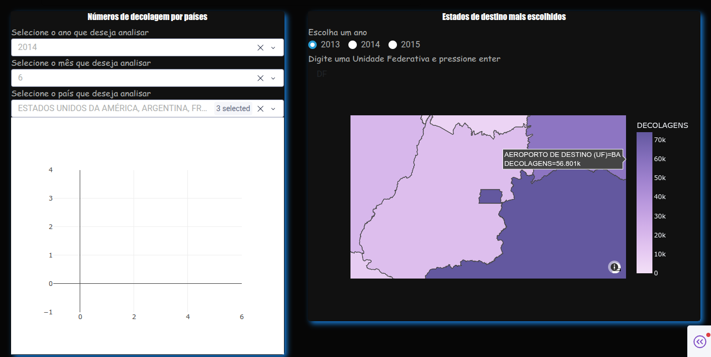
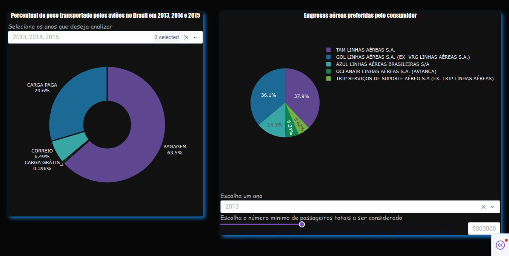
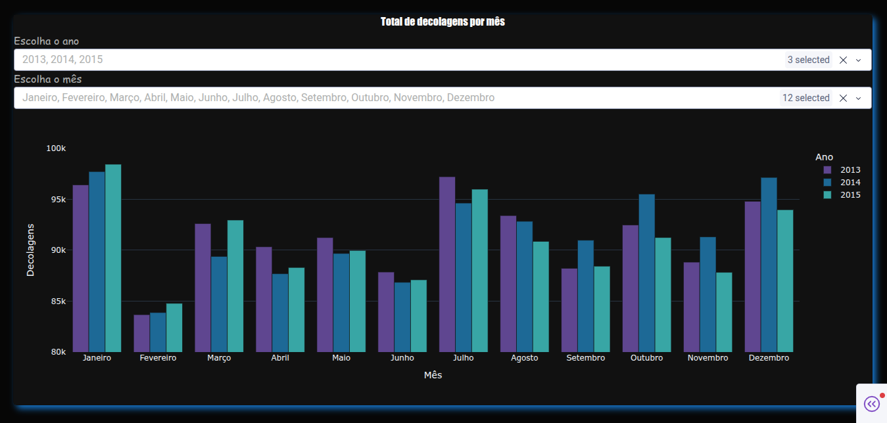

# Grupo A - Tráfego aéreo no Brasil


---

## Visão geral do projeto

Esse é o nosso projeto final da disciplina de APC, onde criamos um **dashboard interativo em Python**.  
Um painel com vários gráficos e métricas com o intuito de demonstrar um conjunto de dados sobre tráfego aéreo no Brasil.







---

## Integrantes

| Matrícula | Nome                               | Nick no GitHub |
|-----------|------------------------------------|----------------|
| 221007626 | Ana Luisa Santana Dantas           | animaniacs003  |
| 221007813 | Andre Emanuel Bispo da Silva       | Hunter104      |
| 221038776 | Andre Luis Bispo Galvao de Souza   | Andre-galvao   |
| 221007887 | Bernardo Barros Blanco             | BBBX9000       |
| 221007949 | Camile Barbosa Gonzaga de Oliveira | Camile1234     |
| 221008070 | Guilherme Resende Carmona          | Guiizon        |
| 221008150 | João Antonio Ginuino Carvalho      | i-JSS          |
| 221007653 | Luciano Ricardo da Silva Júnior    | l-ricardo      |
| 211062277 | Matheus Duarte da Silva            | smmstakes      |
| 221035068 | Paulo Renato Medrado Roque         | paulomedrado   |

---

## Estrutura do projeto

```bash
Dashboard-APC/
├── Dashboard-Oficial/
│   ├── data/
│   │   ├── ANAC20XX-13-14-15.csv
│   │   ├── brasil_estados.json
│   │   └── coord-estados.csv
│   │
│   └── src/
│       ├── assets/
│       ├── barras_data_pico.py
│       ├── barras_paises_origem.py
│       ├── mapa.py
│       ├── painel.py
│       ├── pizza_preferencia_empresa.py
│       ├── pizza_tipo_carga.py
│       └── tabela_utils.py
│
├── requirements.txt
└── README.md
```

---

## Dataset e arquivos importantes
- [Vôos de 2013 até 2015](Dashboard-Oficial/data/ANAC20XX-13-14-15.csv), dados coletados do site da ANAC e processados conforme nossas necessidades.
- [Polígonos dos estados do brasil em forma de GeoJson](Dashboard-Oficial/data/brasil_estados.json), utilizado para a formação gráfica do mapa.
- [Utilidades de tabela](Dashboard-Oficial/src/tabela_utils.py), arquivo com funções que escrevemos que são necessários em múltiplos gráficos, evitando a repetição de código.


# Gráficos
## Mapa dos estados (Gráfico de Mapa)
[Esse gráfico](Dashboard-Oficial/src/mapa.py) é um mapa mostrando quais foram os estados de destino mais famosos durante o período escolhido, sendo possível notar diferenças socioeconômicas entre outros detalhes por estado.

## Preferência de linhas aéreas (Gráfico de Pizza)
[Esse gráfico](Dashboard-Oficial/src/pizza_preferencia_empresa.py) evidencia as preferências de linhas aéreas em todos os vôos relacionados ao brasil, mostrado claramente a tendência de uso das linhas nacionais.

## Tipos de carga (Gráfico de Pizza)
[Esse gráfico](Dashboard-Oficial/src/pizza_tipo_carga.py) desmostra a relação de proporcinalidade entre o peso de carga/bagagem/correio transportados pelos aviões em cada ano.

## Países de origem (Gráfico de Barras)
[Esse gráfico](Dashboard-Oficial/src/barras_paises_origem.py) nos comunica sobre quais países de um grupo seleto tem mais vôos com destino ao Brasil.

## Quantidade de vôos (Gráfico de Barras)
[Esse gráfico](Dashboard-Oficial/src/barras_data_pico.py) demonstra claramente certas tendências quanto a quantidade de voôs no brasil, principalmente os picos em 2014, devido à copa do mundo.